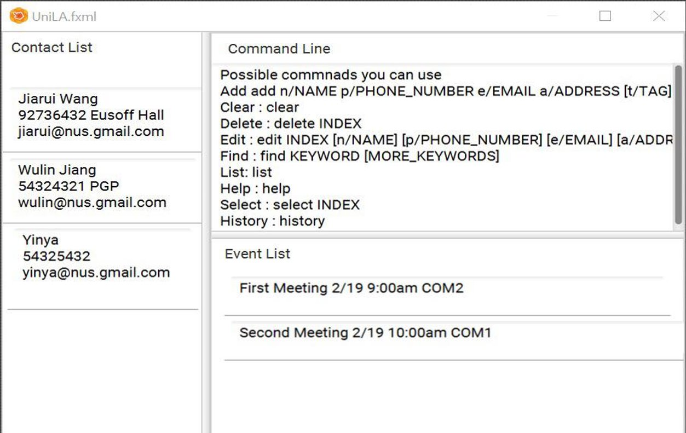

= UniLA
ifdef::env-github,env-browser[:relfileprefix: docs/]

https://travis-ci.org/CS2103-AY1819S2-W16-1/main[image:https://travis-ci.org/CS2103-AY1819S2-W16-1/main.svg?branch=master[Build Status]]
https://ci.appveyor.com/project/jwl1997/main/branch/master[image:https://ci.appveyor.com/api/projects/status/mst7mdtn3neg0lxf/branch/master?svg=true[Build status]]
https://coveralls.io/github/CS2103-AY1819S2-W16-1/main?branch=master[image:https://coveralls.io/repos/github/CS2103-AY1819S2-W16-1/main/badge.svg?branch=master[Coverage Status]]

ifdef::env-github[]
image::docs/images/Ui.png[width="600"]
endif::[]

ifndef::env-github[]

endif::[]

* UniLA is a desktop utility application designed for	NUS students who are typing oriented.
* UniLA provides an efficient and convenient solution for managing contact list and event list, contact interactions, planning meetings, setting up reminders, etc.
* The application is primarily concerned with CLI (Command Line Interface) Interaction, with a simple and intuitive GUI provided.

== Site Map

* <<UserGuide#, User Guide>>
* <<DeveloperGuide#, Developer Guide>>
* <<AboutUs#, About Us>>
* <<ContactUs#, Contact Us>>

== Acknowledgements

* Some parts of this sample application were inspired by the excellent http://code.makery.ch/library/javafx-8-tutorial/[Java FX tutorial] by
_Marco Jakob_.
* AddressBook-Level4 project created by SE-EDU initiative at https://github.com/se-edu/
* Libraries used: https://github.com/TestFX/TestFX[TextFX], https://github.com/FasterXML/jackson[Jackson], https://github.com/google/guava[Guava], https://github.com/junit-team/junit5[JUnit5]

== Licence : link:LICENSE[MIT]
